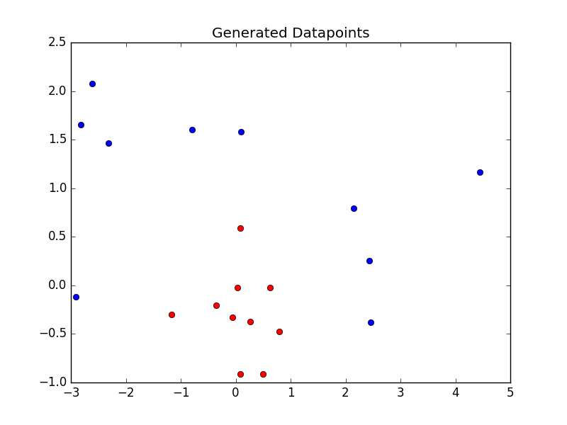
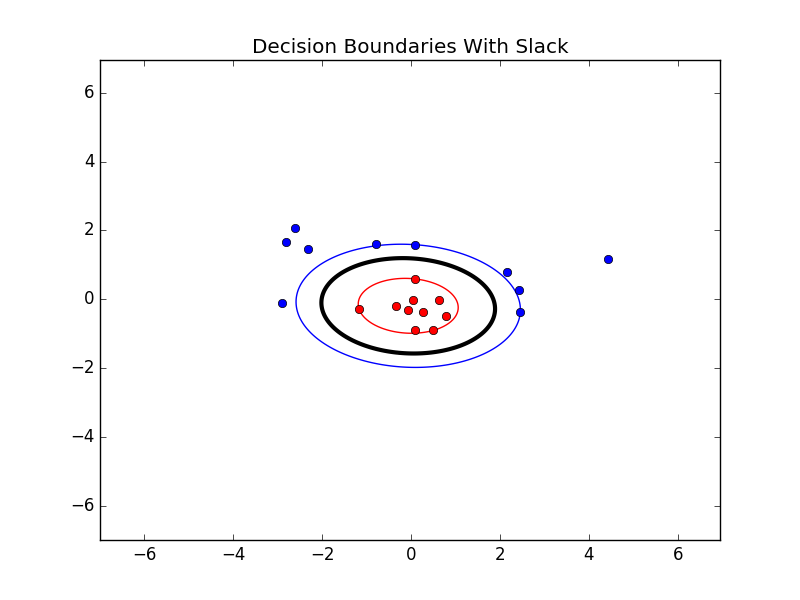

Implementation of a Support Vector Machine for classification. The classifier which first makes an (optional) transformation of the input data, and then a linear separation where the decision boundary is placed to give maximal margins to the available data points.

**Packages used:**
- [x] numpy
- [x] pylab
- [x] cvxopt

